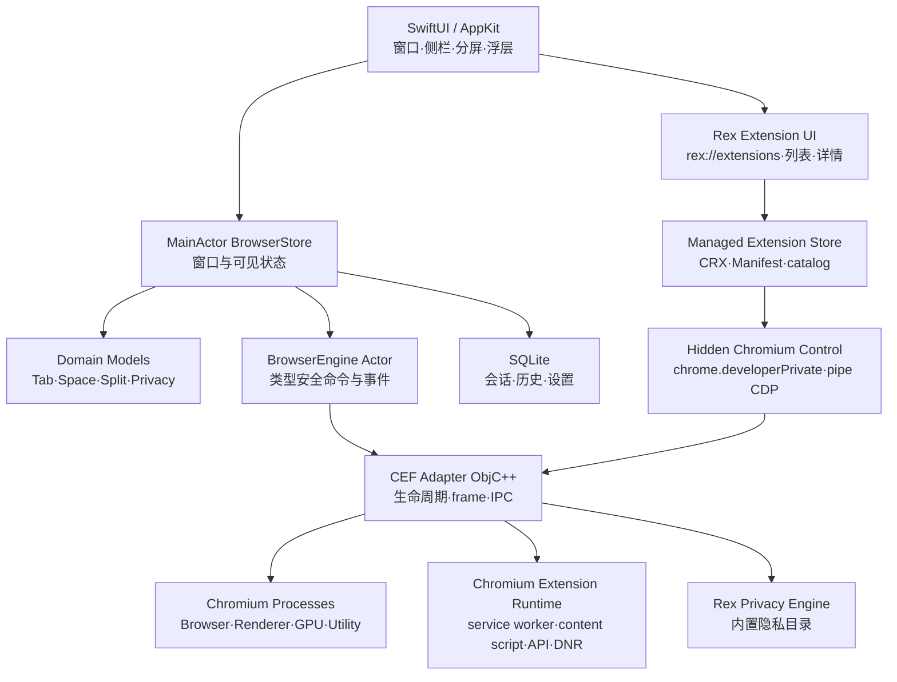
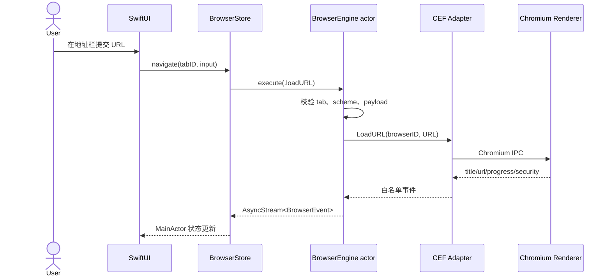

# 技术架构

## 决策摘要

生产内核首选 CEF（Chromium Embedded Framework），原因是它提供可嵌入 API、多进程模型、DevTools 和相对可控的升级面。Content API 或自维护 Chromium 分支可获得最强控制，但每个 Chromium 大版本的合并、安全补丁和 macOS 签名成本显著更高，暂不作为 MVP 首选。

目标基线：macOS 14+，仅支持 Apple Silicon（arm64），不生成通用二进制或 Intel 构建。v0.9.7 固定 CEF standard `150.0.14+g7c1aa68+chromium-150.0.7871.129`。版本策略为跟随 CEF 稳定分支，安全高危补丁目标 72 小时内完成评估和候选构建，常规大版本在上游稳定后一周内进入兼容测试。

## 分层



SwiftUI 不拥有 Chromium 生命周期。稳定的 `NSView` 宿主由 AppKit 层创建并缓存，SwiftUI 只传递 frame、可见性和焦点。CEF 的 C++ API 由 Objective-C++ facade 包裹，再映射到 Swift `Sendable` 值和 `AsyncStream<BrowserEvent>`。

当前窗口 chrome 由 AppKit 配置透明全尺寸标题栏，并从 `standardWindowButton` 的实际 frame 计算红黄绿按钮尾缘；SwiftUI 将 44 pt 单导航卡放在该尾缘加 8 pt 净空的右侧，性能指标是导航栏首项。全屏时不再预留窗口按钮区域，导航卡改用 8 pt 左边距。Rex 保留自己的浏览器窗口、扩展列表、小型面板与管理界面，不显示 Chrome 自己的标签栏、地址栏或扩展管理页；小型面板直接加载扩展清单声明的静态 `default_popup`，options 等资源也直接来自安装包，内部在 `chrome-extension://` 安全源中执行，对外显示为 `rex-extension://`。

## 通信时序



## 核心协议

`BrowserEngine` 负责实例创建/销毁、导航、缩放、查找、DevTools、崩溃恢复、页面优先级与事件流。Swift 层只发送 `BrowserCommand` 枚举；CEF 适配器为每种命令做长度、枚举、URL scheme、tab ownership 与隐私 profile 校验。Chromium 回报的 URL、标题与加载状态是单向观测值，SwiftUI surface 不得把它们重新提交成导航命令；只有明确的用户/应用命令进入 `loadURL`。新主框架请求在 `OnBeforeBrowse` 分配代次，redirect 沿用原请求代次，不依赖聚合 loading 的边沿。禁止通用“执行 JavaScript/调用原生方法”桥。

## v0.9.7 扩展管理与运行时边界

扩展安装和运行被拆成五个边界明确的层次：

1. **可信包管理**：Swift 域层解析 Chrome Web Store URL/ID，限制下载来源与大小，验证 CRX2/CRX3 身份和签名，安全解包后与本地 Manifest V2/V3 文件夹一起保存到 Rex 受管目录。启动时每个包只执行一次完整文件树验证；名称与描述共享一次加载的 locale 字典。
2. **身份与预期集合**：商店包读取时要求合法 store ID、有效 manifest 公钥，且公钥推导出的 Chromium runtime ID 必须与验签安装记录一致。Rex 为每次安装、启停、更新和移除生成受管路径与启用状态的预期集合；Chromium 返回的 ID、路径、版本和启用状态同时进入运行时观测数据。
3. **不可见的 Chromium 管理上下文**：Rex 在 `CefInitialize` 前为 Chromium 预留 fd 3/4 专用传输，并以 `--remote-debugging-pipe` 启动 browser process；browser-target `Extensions.getExtensions` 与 `Extensions.uninstall` 只通过该本地通道调用。`chrome://extensions` 仅在不可见、受控的上下文中提供 `chrome.developerPrivate` API：首次安装调用 `loadUnpacked`，同 ID 更新调用 `reload`，启停调用 `chrome.management.setEnabled`。该上下文不承载任何用户可见页面，没有 TCP 监听端口，也不向普通网页或 page target 暴露 browser CDP 会话。
4. **Chromium 原生执行**：后台 service worker、content script、runtime messaging、`chrome.storage.local`、DNR 与 options 等已支持资源页均来自扩展包并由 Chromium 执行。Rex 不解析规则后模拟扩展行为，也不维护任何扩展专用执行适配器。
5. **Rex 可见产品外壳**：扩展发现、安装状态、列表、详情、权限控件、小型面板入口和 `rex://extensions` 管理路由全部由 Rex SwiftUI/AppKit 实现；该内部路由不会向 Chromium 发送可见导航。小型面板使用独立的无边框 AppKit `NSPanel`，直接加载清单声明的静态 `default_popup`；options 等资源也直接来自已安装扩展包。扩展资源的执行边界仍使用 `chrome-extension://`，用户可见地址统一使用 `rex-extension://<runtime-id>/<包内路径>`。

网站访问配置严格映射 Chromium 的三种运行范围：`ON_CLICK`（点击扩展时）、`ON_SPECIFIC_SITES`（指定网站）和 `ON_ALL_SITES`（所有网站）。“允许运行用户脚本”和“允许访问文件网址”也由 Chromium 保存。Rex 提交 `updateExtensionConfiguration` 后立即调用 `getExtensionInfo`；界面只使用 Chromium 返回的新状态，失败、超时或返回无效数据时保留原读回值并显示错误，不能乐观地把目标值写进本地 UI。

扩展运行时变更按 generation 串行执行。原生 `loadUnpacked`、`reload`、启停或卸载操作必须成功，`Extensions.getExtensions` 必须确认实际启用的受管路径与当前预期集合一致，受管包也必须仍匹配事务开始时的指纹快照，generation 才能提交；注册表字段表面一致不能掩盖原生操作错误或事务期间的二次换盘。已停用扩展重新启用时先调用 `management.setEnabled(true)`，随后无条件调用 `developerPrivate.reload`，确保 Chromium 重新读取禁用期间发生的同版本 JS/CSS 变化。成功变更后，Rex 对活跃普通窗口中已加载的 HTTP(S) 页面各重载一次；休眠或冻结页面记录一次待处理重载并在恢复时执行，隐私窗口与内部页面不参与。失败 generation 不直接重载，只有随后成功提交的补偿 generation 才统一刷新。

冷启动恢复不会把“`CefInitialize` 已返回”误作扩展就绪，也不会重新安装已经存在于 Chromium profile 的受管扩展。恢复的 HTTP(S) browser 先保持 `about:blank` 与 pending URL；当前 generation 完成后才统一放行首次导航。每个标签的占位标记不会随屏障释放而删除，只在首个非空、非 `about:blank` 地址提交时清除，因此延迟地址/标题回调不会发布到 Rex 导航状态或覆盖持久会话。预期集合为空时也必须先通过 CDP 清理 Chromium profile 中可能残留的受管 unpacked 扩展，不能直接绕过屏障。连续冷启动不得重复触发 `runtime.onInstalled` 或 onboarding，并必须保持 `chrome.storage.local` 身份不变。`chrome.tabs.create` 的转交路径只在主框架确定加载 `about:blank` 后才按空白目标处理，避免临时 Chrome browser 与 Rex 正式标签对同一 URL 分别导航。

Swift 扩展事务由进程级异步门串行化，状态只由对应命令 completion 提交，不接受无关联 generation 的广播二次写入。同路径更新在目录换盘前原子写入 `runtime-replacements.json`，记录旧包、目标、备份和事务阶段；Chromium 确认后才提交并清理备份，确认前崩溃则在下次启动恢复上一版本。原生事务指纹覆盖目录与 manifest 元数据，用于识别 Rex 的原子换盘；它不是整棵文件树的内容哈希。用户重新导入 Rex 受管目录自身时会显式传递强制重载路径，使既有 JS/CSS 原地覆写不依赖该指纹变化。多个普通窗口合并首次全量对账；窗口关闭会取消该窗口恢复、导航、休眠和事件任务，随后销毁其全部 Chromium 页面。

真实 popup 内容由扩展包决定尺寸：非广告 fixture 为 `280×113`，显示 `Ready` 并与 service worker 完成消息交互；AdGuard 经相同通用路径调整为 `320×600`，分段交互有效，没有扩展专用执行适配器。普通 Rex UI 仍使用原有 Alloy 子视图嵌入，没有网页裁剪、负偏移或 Chrome 顶层窗口覆盖。未托管的 Chrome extension popup/auxiliary window 会把普通网页目标转交 Rex，再关闭辅助窗口。

Rex 小型面板不触发 Chromium 原生 action popup。面板 surface ID 只解析出经过验证的来源 tab identity；popup 主文档包装 `chrome.tabs.query` 后使用 Chromium `tabs.get(tabId)` 获取按扩展权限裁剪的 Tab，并只修正 active/highlighted 语义。Rex 不向 renderer 注入来源 URL 或标题；`chrome.tabs.getCurrent()` 仍按 action popup 语义返回空。stock CEF 150 的 Alloy 嵌入路径仍不提供完整 `activeTab` 授权，也不支持未声明静态 `default_popup` 时的 `action.onClicked` 和运行时 `action.setPopup` 动态变更。这些限制意味着核心探针通过不等同于所有 Chrome Web Store 扩展或全部 Chrome API 均兼容。

Rex 源码和主可执行文件不包含 `SystemPasswordsCoordinator` 或 `AuthenticationServices` 依赖，不实现系统密码调用。打包门槛会拒绝 Rex 主 executable 链接该 framework 或 App 包含任何 `.systemextension`，并在 `PACKAGE-INFO.txt` 写入 `rex_password_integration=absent`。上游 Chromium Embedded Framework 自身仍链接该系统 framework，因此 bundle 级依赖审计不能据此声称完全不存在 `AuthenticationServices`。

CEF 的 macOS 正常退出遵循官方 external-pump 顺序。Rex 先保存全部活动标准窗口会话并关闭 Chromium browser；最后一个 `OnBeforeClose` 完成后停止 AppKit 主循环。进程启动时安装的 `NSApplication.run` hook 等待原始 event loop 返回，再执行 10 次 run-loop/CEF pump 排空并调用 `CefShutdown()`，保证 SwiftUI 的 `App.main()` 尚未进入 `exit()`。内部 DevTools pipe 在 browser 关闭前断开，但 Chromium 侧 fd 3/4 保留到 `CefShutdown()` 返回，避免描述符复用。自动 smoke 额外使用 `--use-mock-keychain` 隔离用户 Keychain；正式启动不使用该测试参数。

## 工程目录

```text
Sources/RexApp/
├── Application/        # 入口和命令菜单
├── Domain/             # Codable/Sendable 核心模型
├── BrowserCore/        # BrowserEngine 协议与预览引擎
├── State/              # MainActor 状态容器
├── DesignSystem/       # 液态玻璃 token 与组件
├── Features/
│   ├── AppShell/
│   ├── Tabs/
│   ├── Spaces/
│   ├── SplitView/
│   └── Privacy/
└── Resources/ReleaseNotes/
```

当前工程包含 `ChromiumIntegration`（ObjC++）、SQLite `Persistence`、ARM64 CEF 锁文件、独立 Helper 构建、内容拦截、权限与完整下载状态桥；诊断与正式更新链路继续收敛。

## CEF 集成和发布限制

- CEF 主 Helper、Alerts、GPU、Plugin 与 Renderer 五个进程包分别生成；本地 Debug 包不执行分发签名。当前启用 Chromium sandbox，不启用 Mac App Store App Sandbox。
- CEF 150 使用官方 standard ARM64 发行包。Rex 在应用层实现 Chrome Web Store CRX 下载、身份/签名校验、安全解包、受管安装和产品外壳；真实扩展包由 Chromium 执行，运行集合经内部 pipe 热同步。当前验证范围覆盖 MV3 核心运行链，但不承诺每个 Chrome Web Store 扩展、全部 Chrome API 或商店自动更新均兼容。
- Mac App Store 的 App Sandbox、可执行代码和更新机制可能与 Chromium 分发方式冲突；优先规划 Developer ID 签名、公证和 Sparkle 类差分更新，App Store 作为独立可行性研究。
- CEF 二进制体积、通用架构构建、编解码器专利和 Widevine 分发必须单独评估。
- Swift Package 的 `PrototypeWebSurface` 仅用于无 Xcode 环境下的 UI 验证；`Rex.xcodeproj` 使用 `ChromiumBrowserSurface` 和固定 CEF runtime。


## v0.9.5 隐私、性能与开发者工具

Rex 在固定 CEF 预编译运行时之上叠加可审计的隐私分类与性能参数：

1. **性能层**（Thorium 风格）：`ChromiumBridge/Privacy/RexThoriumFlags` 在浏览器/子进程启动参数注入 GPU、网络与进程策略优化。
2. **顶层导航隐私层**：Swift `PrivacyURLPolicy` 在地址栏导航和 Rex 接管的弹窗导航中删除已知追踪参数，并把符合条件的 HTTP URL 改为 HTTPS 尝试；特定 TLS 不可用错误可回退到原 HTTP URL。该层不改写 CEF 自行发起的子资源请求。
3. **CEF 子资源隐私层**：`RexPrivacyEngine` 内置 45 个广告、41 个追踪、10 个指纹和 8 个社交目录条目，并用固定 Mozilla PSL `2026-07-25` 判断第一方站点。标准模式匹配第三方广告/追踪；指纹保护匹配第三方已知指纹服务。严格模式追加社交目录；自定义映射为 CEF aggressive。保护策略按 profile/PSL 站点写入 SQLite；扩展 DNR 仍由 Chromium 独立执行。
4. **Cookie 层**：第三方 Cookie 限制通过 CEF RequestContext/profile 的 `profile.cookie_controls_mode` 全局设置执行，而非每标签 `CanSendCookie`/`CanSaveCookie` 回调。单个标签页关闭盾牌不会关闭全局 Cookie 限制。
5. **扩展管理性能**：受管扩展启动时只完整扫描一次；启停只更新内存运行状态。单次 manifest 解析只读取一次本地化消息字典，Chrome Web Store 下载中的进度约每 80 毫秒合并发布一次，终态不延迟。

第一方判断与 Rex 站点策略读取同一次安全资源选择中的 Mozilla PSL，覆盖 ICANN/private suffix、通配、例外、IDN、localhost 与 IP。bundle 基线可由 Ed25519 签名的 PSL + 隐私目录包更新，并使用候选启动验证/LKG/回退；未配置生产端点和公钥时保持离线基线。Rex 明确不提供恶意网站检测或 Safe Browsing，也没有 EasyList、自定义订阅或通用 Canvas/WebGL 指纹随机化。

开发者工具直接复用固定 CEF 版本内置的 Chromium 前端：

- SwiftUI 液态玻璃停靠宿主：`ChromiumDeveloperToolsSurface`
- 完整 Elements、Console、Sources、Network、Performance、Memory、Application、Security 与 Settings 由 CEF DevTools 前端提供
- DevTools 界面与协议均由 CEF 内置 Chromium DevTools 提供，不保留自制 Swift 面板或 CDP 会话桥
- 快捷键对齐 Chrome：`⌘⌥I` / `⌘⌥J` / `⌘⇧C` / `⌘⇧R` 等
