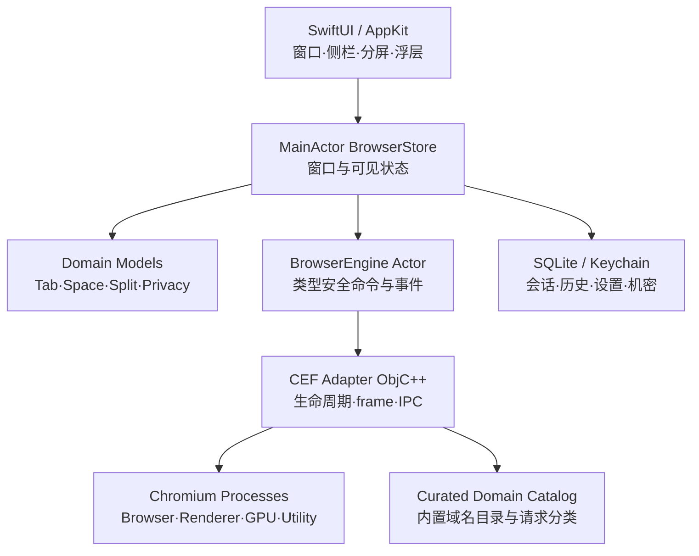
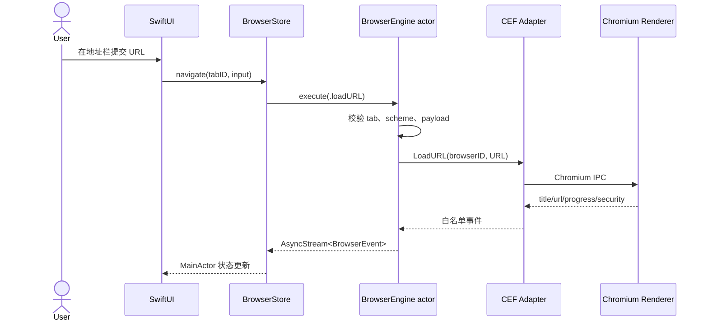

# 技术架构

## 决策摘要

生产内核首选 CEF（Chromium Embedded Framework），原因是它提供可嵌入 API、多进程模型、DevTools 和相对可控的升级面。Content API 或自维护 Chromium 分支可获得最强控制，但每个 Chromium 大版本的合并、安全补丁和 macOS 签名成本显著更高，暂不作为 MVP 首选。

目标基线：macOS 14+，仅支持 Apple Silicon（arm64），不生成通用二进制或 Intel 构建。v0.9.0 固定 CEF `150.0.14+g7c1aa68+chromium-150.0.7871.129`。版本策略为跟随 CEF 稳定分支，安全高危补丁目标 72 小时内完成评估和候选构建，常规大版本在上游稳定后一周内进入兼容测试。

## 分层



SwiftUI 不拥有 Chromium 生命周期。稳定的 `NSView` 宿主由 AppKit 层创建并缓存，SwiftUI 只传递 frame、可见性和焦点。CEF 的 C++ API 由 Objective-C++ facade 包裹，再映射到 Swift `Sendable` 值和 `AsyncStream<BrowserEvent>`。

v0.9.0 的窗口 chrome 由 AppKit 配置透明全尺寸标题栏，并从 `standardWindowButton` 的实际 frame 计算红黄绿按钮尾缘；SwiftUI 将 44 pt 单导航卡放在该尾缘加 8 pt 净空的右侧，性能指标是导航栏首项。全屏时不再预留窗口按钮区域，导航卡改用 8 pt 左边距。

## 通信时序



## 核心协议

`BrowserEngine` 负责实例创建/销毁、导航、缩放、查找、DevTools、崩溃恢复、页面优先级与事件流。Swift 层只发送 `BrowserCommand` 枚举；CEF 适配器为每种命令做长度、枚举、URL scheme、tab ownership 与隐私 profile 校验。禁止通用“执行 JavaScript/调用原生方法”桥。

## 工程目录

```text
Sources/RexApp/
├── Application/        # 入口和命令菜单
├── Domain/             # Codable/Sendable 核心模型
├── BrowserCore/        # BrowserEngine 协议与预览引擎
├── State/              # MainActor 状态容器
├── DesignSystem/       # 液态玻璃 token 与组件
├── Features/
│   ├── AppShell/
│   ├── Tabs/
│   ├── Spaces/
│   ├── SplitView/
│   └── Privacy/
└── Resources/ReleaseNotes/
```

当前工程包含 `ChromiumIntegration`（ObjC++）、SQLite `Persistence`、ARM64 CEF 锁文件、独立 Helper 构建、内容拦截、权限与完整下载状态桥；诊断与正式更新链路继续收敛。

## CEF 集成和发布限制

- CEF 主 Helper、Alerts、GPU、Plugin 与 Renderer 五个进程包分别生成；本地 Debug 包不执行分发签名。当前启用 Chromium sandbox，不启用 Mac App Store App Sandbox。
- CEF 150 最小发行包不包含 `CefExtension` / `LoadExtension` 类 API，因此不承诺 Chrome Web Store 直接安装、自动更新或完整 Manifest V3 运行时。
- Mac App Store 的 App Sandbox、可执行代码和更新机制可能与 Chromium 分发方式冲突；优先规划 Developer ID 签名、公证和 Sparkle 类差分更新，App Store 作为独立可行性研究。
- CEF 二进制体积、通用架构构建、编解码器专利和 Widevine 分发必须单独评估。
- Swift Package 的 `PrototypeWebSurface` 仅用于无 Xcode 环境下的 UI 验证；`Rex.xcodeproj` 使用 `ChromiumBrowserSurface` 和固定 CEF runtime。


## v0.9.0 隐私、性能与开发者工具

Rex 在固定 CEF 预编译运行时之上叠加可审计的隐私分类与性能参数：

1. **性能层**（Thorium 风格）：`ChromiumBridge/Privacy/RexThoriumFlags` 在浏览器/子进程启动参数注入 GPU、网络与进程策略优化。
2. **顶层导航隐私层**：Swift `PrivacyURLPolicy` 在地址栏导航和 Rex 接管的弹窗导航中删除已知追踪参数，并把符合条件的 HTTP URL 改为 HTTPS 尝试；特定 TLS 不可用错误可回退到原 HTTP URL。该层不改写 CEF 自行发起的子资源请求。
3. **CEF 子资源隐私层**：`RexPrivacyEngine` 内置 45 个广告、41 个追踪、10 个指纹和 8 个社交目录条目。标准模式匹配第三方广告/追踪；指纹保护默认为开启，因此标准模式也匹配第三方已知指纹服务。严格模式追加社交目录；Swift 的自定义模式映射为 CEF aggressive，允许广告/追踪目录匹配第一方请求，并仅对第三方请求使用路径启发式。主框架导航永不在此层取消；无法判断第一方时放行。命中项由 `OnBeforeResourceLoad` 返回 `RV_CANCEL`。
4. **Cookie 层**：第三方 Cookie 限制通过 CEF RequestContext/profile 的 `profile.cookie_controls_mode` 全局设置执行，而非每标签 `CanSendCookie`/`CanSaveCookie` 回调。单个标签页关闭盾牌不会关闭全局 Cookie 限制。

第一方判断使用当前 C++ 实现的有限 registrable-domain 启发式和少量常见二级后缀，不是完整 PSL/eTLD+1 实现。当前也没有 EasyList、自定义规则订阅、恶意网站检测、Safe Browsing 或通用 Canvas/WebGL 指纹随机化。

开发者工具直接复用固定 CEF 版本内置的 Chromium 前端：

- SwiftUI 液态玻璃停靠宿主：`ChromiumDeveloperToolsSurface`
- 完整 Elements、Console、Sources、Network、Performance、Memory、Application、Security 与 Settings 由 CEF DevTools 前端提供
- DevTools 界面与协议均由 CEF 内置 Chromium DevTools 提供，不保留自制 Swift 面板或 CDP 会话桥
- 快捷键对齐 Chrome：`⌘⌥I` / `⌘⌥J` / `⌘⇧C` / `⌘⇧R` 等
