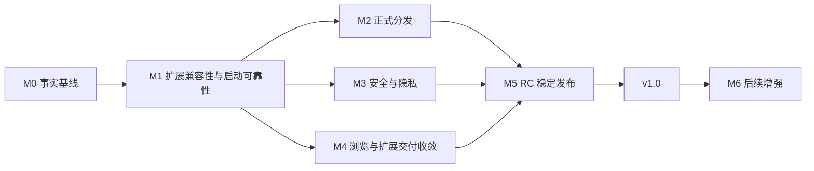

# Rex v1.0 未来实施计划

最后更新：2026-07-30
起始基线：v0.9.7（build 970，本地 Beta）
目标：从本地 Beta 工程包推进到可正式分发、可更新、可诊断的 v1.0 稳定版

本文把 `CurrentProjectStatus.md` 中的问题转换为可执行里程碑。计划按依赖和退出条件推进，不预先承诺日历日期；Developer ID 证书、更新服务、测试设备和安全服务选型等外部条件会直接影响交付时间。

M0-M5 对应到当前 `v0.9.7` 本地 Beta 至 `v1.0.0` 的具体工作包、交付物和版本门禁，见 [逐版本工作计划](VersionPlan.md)。

## 1. v1.0 完成定义

v1.0 不是“把所有浏览器能力做完”，而是达到以下稳定发布标准：

1. 所有 P0 问题关闭：Rex `rex://extensions` 路由正确，网站访问三态、用户脚本和文件网址均以 Chromium 写入后读回为准，且不存在扩展故障导致浏览器永久停在 `about:blank` 或冷启动重复打开 onboarding 的路径。
2. App、CEF 和全部 Helper 使用同一 Developer ID 团队签名，启用 Hardened Runtime，通过公证、装订和 Gatekeeper 验证。
3. 应用更新具备签名验证、失败恢复和回退演练；扩展更新继续经过 CRX 身份验证和事务保护。
4. 文件选择、JavaScript 对话框、全屏、Renderer 崩溃恢复和默认浏览器等基础浏览流程达到稳定版标准。
5. 危险下载、隐私目录更新、站点归属判断和隐私窗口落盘语义具有明确且经过测试的安全边界。
6. 扩展兼容范围由版本化能力矩阵、API 探针和真实扩展样本共同定义，不把核心 MV3 探针通过、合成标签元数据或 UI 开关状态描述为完整 Chrome 兼容。
7. 支持范围内的 macOS、显示模式、多窗口、分屏、会话恢复和更新路径通过 RC 门禁。
8. 发布文档、应用内功能数据、源码能力和交付包信息一致。

## 2. 实施原则

- **扩展兼容性先于其他近期功能。** M1 先关闭 Rex 管理路由、Chromium 配置权威读回、站点访问/用户脚本、action/current tab 语义和启动恢复问题；完成前不扩大分屏或视觉功能范围。
- **成功和降级必须可区分。** 扩展对账成功时保证首次文档应用预期扩展；失败或超时时放行导航，但明确标记 degraded，不能伪装成 ready。
- **Developer ID 是 v1.0 主分发路径。** Mac App Store 只做后续可行性研究，不阻塞 Developer ID 稳定版。
- **固定内核再收敛。** M1 至 M2 默认固定当前 CEF 150 基线；除高危安全补丁外，不把 CEF 大版本升级与启动/签名改造放在同一里程碑。
- **能力不足时明确收口。** stock CEF 无法可靠提供的 Chrome API，应通过能力矩阵、界面和发布说明明确限制，不用近似模拟制造错误兼容预期。
- **每个完成结论必须有证据。** 没有实际命令输出、自动化结果或实机记录，不把工作标记为已通过。

## 3. 里程碑总览

| 里程碑 | 目标 | 主要产物 | 是否阻塞 v1.0 |
|---|---|---|---|
| M0 事实基线 | 统一源码、功能数据和文档口径 | 文档修正、问题编号、基线报告 | 是 |
| M1 扩展兼容性与启动可靠性 | 让已承诺权限真实生效并消除导航死锁 | 能力矩阵、Rex 管理 UI、Chromium 配置读回、权限/action 探针、启动故障矩阵 | 是 |
| M2 正式分发 | 完成签名、公证和应用更新 | Developer ID 包、公证、更新/回退链路 | 是 |
| M3 安全与隐私 | 补齐规则更新、站点归属和下载安全 | 签名目录、PSL、下载防护、安全决策 | 是 |
| M4 浏览与扩展交付收敛 | 完成基础浏览、扩展自动更新和更广样本回归 | 浏览流程、扩展更新、分类样本报告 | 是 |
| M5 RC 稳定发布 | 完成兼容、压力、恢复和发布验收 | RC 报告、v1.0 包、更新 feed | 是 |
| M6 后续增强 | 推进非阻断能力 | App Store 研究、分屏/指标/容器增强 | 否 |

M2、M3、M4 可以在 M1 退出后并行推进，但 M5 必须等待三条路径全部满足退出条件。

## 4. M0：事实基线与计划门禁

### 工作内容

1. 修正当前已知文档偏差：README 的失败放行、FEATURES 的空集合对账、Cookie 容器范围、扩展活动标签上下文、安全性能/低电量描述和架构图 Keychain 标注。
2. 明确单一事实来源：版本、构建号和发布记录由现有结构化 Release Notes 数据校验；扩展能力由一个可测试的 capability 模型输出到应用界面和文档。
3. 给当前问题建立稳定 ID，并在每个后续版本中记录“未开始、进行中、已验证、接受限制”四种状态。
4. 保留 v0.9.5/v0.9.6 的历史基线数据，并为 build 970 另存启动阶段耗时、恢复窗口数、首个网页导航时间、扩展 generation 结果、进程数、空闲资源和典型双页资源；不得复用旧包尺寸或哈希。
5. 固定 M1-M2 使用的 CEF、Xcode、macOS 和测试扩展版本，避免移动基线掩盖回归。

### 退出条件

- README、FEATURES、架构、安全文档、应用内功能数据和当前状态文档没有已知互相矛盾项。
- 文档/发布校验能拒绝版本、构建号、功能 ID、能力文案和发布说明的不一致。
- 基线报告包含可重复命令、环境、输入包和结果，不只保存人工结论。
- 后续每个当前问题都能映射到本文的一个里程碑或明确的非目标。

## 5. M1：扩展兼容性与启动可靠性

这是当前最高优先级。先保证 Rex 管理页把网站访问、用户脚本和文件网址配置提交给 Chromium 并以即时读回结果刷新，再验证 Tampermonkey 在网页中的真实行为；同时收敛 action/current tab 和 native messaging 边界，并保留有界导航屏障。

### 工作内容

| 工作包 | 实施要求 |
|---|---|
| 版本化能力矩阵 | 每项记录 CEF/Chromium、macOS、夹具或商店包版本/哈希、自动化结果和限制；状态只用已验证、部分支持、未通过、未验证、受限 |
| Rex 扩展管理 UI | `rex://extensions` 的列表、详情、返回、安装、启停、移除和 options 入口全部由 SwiftUI/AppKit 呈现，不触发 Chromium 可见导航；`chrome://extensions` 只在不可见受控上下文中提供 `chrome.developerPrivate` API |
| Chromium 配置权威读回 | 网站访问严格覆盖 `ON_CLICK`、`ON_SPECIFIC_SITES`、`ON_ALL_SITES`；用户脚本和文件网址在写入后立即读回，成功、拒绝、超时、陈旧值与重试均以 Chromium 返回值刷新 UI |
| 站点访问与脚本 | 为静态/可选 host permission、`activeTab`、`tabs.sendMessage`、`webNavigation.getAllFrames`、`scripting` 和 `userScripts` 建立授权、撤销、frame、导航及重载探针；Tampermonkey 的允许用户脚本 + 所有网站场景必须实测 |
| action 与当前标签 | 区分来源 URL/标题元数据、真实 tab ID 和权限授予；验证静态 popup、无 popup `action.onClicked` 与动态 `action.setPopup`，不可行项必须明确受限 |
| native messaging | 先用可控测试 host 验证通用协议、断线与错误；区分“扩展包已加载”和“外部 host 可用”。iCloud 只校验并安装系统原始 manifest，不复制 helper，并以 Apple managed entitlement、Developer ID 签名、真实 tab/frame 消息和原始 helper 端到端结果判定支持 |
| 启动状态机 | 明确定义 `reconciling`、`ready`、`degraded`，记录 generation、开始时间、失败原因和实际受管集合 |
| 有界屏障 | 为 pipe 无响应、Chromium 未返回和事务挂起设置可测试的 deadline；deadline 基于 M0 数据确定并允许测试时注入时钟 |
| 成功语义 | 只有实际启用集合与预期集合一致时进入 ready；恢复页面首次文档必须已经应用 content script/DNR |
| 失败语义 | 失败或超时后报告扩展错误、进入 degraded 并放行 pending URL；首次文档明确不承诺扩展已生效 |
| 空集合语义 | 即使没有启用扩展，也完成一次精确对账并清理旧的受管注册后才进入 ready |
| 持久恢复语义 | 已安装扩展由 Chromium profile 恢复，不重复调用首次安装；连续启动不得产生新的 `runtime.onInstalled`、onboarding 或安装成功页，storage identity 保持不变 |
| 恢复操作 | 提供可见错误状态和“重试扩展”入口；成功补偿 generation 只触发一次必要页面重载 |
| 事务恢复 | 覆盖 replacement journal、连续失败、进程终止、窗口关闭和下一次启动回滚 |

### 必测故障矩阵

| 场景 | 预期结果 |
|---|---|
| `rex://extensions` 列表、详情及操作 | Rex 路由与状态正确，不发送引擎可见导航；隐藏 `chrome://extensions` 不出现在任何用户窗口 |
| 网站访问三态、用户脚本与文件网址 | 每次修改均完成 Chromium 写入与即时读回；读回不同或失败时 UI 不显示乐观目标值 |
| Tampermonkey：用户脚本开启 + 所有网站 | 受支持 HTTP(S) 页面获得真实权限并执行最小用户脚本；UI 状态与运行时结果一致 |
| 连续冷启动 Tampermonkey | 不重复打开 onboarding/安装成功页，不触发新的 `runtime.onInstalled`，持久 storage identity 不变 |
| host permission 允许、撤销和跨来源导航 | 只在授权来源注入/通信，撤销后停止，重启后状态和实际行为一致 |
| 静态 popup 查询并向来源页发送消息/注入 | 真实 tab/permission 语义通过；若 stock CEF 无法提供，界面不得误报为完整当前标签支持 |
| 通用 native messaging host | 握手、消息、断线、host 缺失和拒绝均有明确结果；iCloud 结果独立记录 |
| 空扩展集合 + profile 有旧注册 | 清理旧注册，首次导航只发生一次 |
| 扩展文件缺失或 manifest 损坏 | 报告具体包错误，放行网页，不永久停留 `about:blank` |
| DevTools pipe 初始化失败 | 进入 degraded，在 deadline 内释放所有普通网页导航 |
| pipe 建立但永不回复 | 超时、取消悬挂请求、释放屏障，退出时没有遗留任务 |
| generation 1 失败、generation 2 补偿成功 | 不在失败 generation 重载；成功后每个活跃普通网页最多重载一次 |
| 多窗口同时恢复 | 只执行一次进程级首次对账，各窗口 pending URL 均正确释放 |
| 恢复期间关闭窗口 | 不复活已关闭窗口，不用占位标签覆盖旧会话 |
| 更新换盘后强制终止 | 下次启动恢复上一版本，目录和运行集合一致 |
| 隐私窗口 | 不等待扩展、不执行扩展、不参与补偿重载 |

### 退出条件

- 能力矩阵与自动探针逐项对应；未覆盖能力保持未验证，任何真实扩展样本都不用于外推“全扩展兼容”。
- Rex `rex://extensions` 路由、Chromium 配置写入后读回，以及 Tampermonkey 最小用户脚本的授权、撤销、重启实测通过。
- 来源标签 URL/标题、真实 tab ID、`activeTab` 与脚本权限不再混为同一 capability；支持不了的 action API 有用户可见限制。
- native messaging 的通用能力有独立结论；iCloud Passwords 只有获得 Apple managed entitlement 或被 helper 的签名名单接纳，且原始 helper 与正式签名 Rex 端到端通过时才可标记支持；当前 ad-hoc ZIP 必须显示受限。
- 自动化覆盖成功、失败、超时、空集合、补偿、多窗口和退出路径。
- 任一扩展启动故障都不能让普通网页无限期停在 `about:blank`。
- ready 路径的首次文档探针无需刷新或重复导航即可验证 content script 和 DNR。
- degraded 路径保留可诊断错误，用户可以继续浏览并主动重试。
- 故障注入后没有重复导航、重复重载、孤立 Chromium 窗口或未结束异步任务。

## 6. M2：Developer ID、公证与应用更新

### 前置条件

- Apple Developer 团队、Developer ID Application 证书和公证凭据可用。
- 确定正式 bundle ID、更新 feed 地址、发布通道和更新签名密钥保管方式。
- CI 或发布机能够从干净环境重建固定 CEF 依赖。

### 工作内容

1. 给打包脚本增加明确的 local 和 distribution 模式；local 保留 ad-hoc，distribution 拒绝空 identity、Hardened Runtime 关闭或 Team ID 不一致。
2. 审计主 App、CEF framework、动态库和五个 Helper 所需 entitlement，只保留 CEF/Chromium 实际需要的最小集合。
3. 按内到外顺序使用同一团队签名嵌套代码和主 App，启用 Hardened Runtime 与可信时间戳。
4. 自动提交公证、等待结果、装订 ticket，并对最终复制包和解压后的 App 重复验签。
5. 以 Sparkle 2 作为 Developer ID 更新链路的首选验证对象；若 CEF 嵌套签名或产品约束不兼容，必须用决策记录说明替代方案。
6. 先完成签名完整包更新，再评估差分更新；更新包、appcast 和回退包必须分别签名和校验。
7. 建立 stable/beta 通道、版本单调性、跳过版本、下载失败、验签失败、安装失败和启动失败回退流程。
8. 所有证书、私钥、公证 token 和更新签名密钥放在系统钥匙串或 CI secret 中，不写入仓库和交付包。

### 退出条件

- `codesign --verify --deep --strict` 通过，主 App、CEF 和 Helper 的 Team ID、版本和架构一致。
- Hardened Runtime 在最终包中启用，entitlement 清单经过人工安全审计。
- `notarytool` 返回 accepted，`stapler validate` 和 `spctl --assess` 通过。
- 带 quarantine 的全新用户环境可以首次启动、打开网页、运行 Helper 和扩展，不需要手工移除隔离属性。
- 一台安装旧签名 Beta 的机器可更新到新版本；网络中断、签名错误和损坏包不会替换当前可用版本。
- 至少完成一次自动更新后的启动失败回退演练，并保存日志和产物哈希。

Mac App Store 不属于本里程碑。App Sandbox、可执行扩展代码和商店政策在 M6 单独评估。

## 7. M3：安全与隐私基线

### 工作内容

| 问题 | 计划 | v1.0 验收 |
|---|---|---|
| 内置隐私目录不会更新 | 定义版本化、签名、大小受限的规则包；支持原子安装、last-known-good、回滚和 kill switch | 有效更新生效；过期、损坏、降级或错误签名包被拒绝，离线继续使用最后有效版本 |
| hostname/第一方判断有限 | 接入维护中的 PSL 数据或可靠库，覆盖 ICANN/private suffix、IDN、localhost 和 IP | eTLD+1 与站点策略测试覆盖常见及边界后缀，不再依赖少量手写后缀 |
| 第三方 Cookie 语义易误解 | 设置页明确标为应用级共享开关；暂不伪装为按网站能力 | 普通/隐私 RequestContext 同步行为有测试，网站盾牌不再暗示可独立切换 Cookie |
| 隐私统计累计 | 决定采用“当前文档”或“标签会话累计”语义，并让 UI、存储和文档一致 | 导航、恢复和清理后的计数行为可预测且有测试 |
| 危险下载缺少提示 | 校验扩展名/MIME、可执行或脚本类型和 quarantine 行为；危险类型需要明确确认 | 常见可执行、脚本、双扩展名和 MIME 不一致样本均触发正确提示 |
| 隐私窗口下载会落盘 | 保存前明确提示；只阻止普通资料库记录，不能宣称无磁盘痕迹 | 关闭隐私窗口后无普通历史/下载记录，但所选文件及提示语义符合预期 |
| 恶意网站检测缺失 | 在 M3 开始时完成 threat-provider/本地列表/明确不提供三选一决策，评估隐私、许可、延迟和离线行为 | v1.0 的界面和发布声明必须与实际选择一致；不能使用“安全浏览”暗示不存在的检测能力 |
| 指纹保护有限 | 继续准确命名为已知指纹服务网络拦截；通用随机化列入 M6 研究 | 应用内不把当前能力描述为 Canvas/WebGL/Audio 随机化 |

### 退出条件

- 隐私目录更新和回滚通过单元、集成和故障注入测试。
- PSL 数据来源、版本和更新策略可审计，站点策略迁移不会静默扩大或丢失范围。
- 下载安全提示不能被普通重命名、MIME 不一致或取消/重试路径绕过。
- 隐私窗口、Cookie、指纹和恶意网站检测的产品文案与真实能力一致。
- 完成一次扩展 CRX、普通下载、隐私目录包和应用更新包的供应链边界审计，四类签名/校验不能互相混用。

## 8. M4：基础浏览与扩展交付收敛

### 基础浏览

1. 完成原生文件选择，覆盖单文件、多文件、文件夹、取消、上传中休眠保护和安全作用域访问。
2. 完成 JavaScript alert/confirm/prompt/beforeunload 对话框，确保多窗口焦点、页面关闭和导航取消语义正确。
3. 完成网页全屏进入/退出、菜单栏/Dock、分屏冲突、Escape 和多显示器恢复。
4. 为 Renderer 崩溃提供明确错误页、重载、关闭和恢复动作；不能只在性能页显示 crashed。
5. 收敛页面安全状态，证书错误、HTTP、HTTPS、混合内容和加载中 generation 不显示过时结果。
6. 接入 macOS 默认浏览器注册与状态检测；失败时显示系统可操作的错误，而不是静默切换。
7. 持久化窗口尺寸、位置和显示器标识，并在显示器缺失时约束到当前可见区域。
8. 决定新标签页收藏和资料库收藏是否合并；无论选择哪种方式，都要让界面名称和数据边界清楚。
9. 完成键盘遍历、VoiceOver 标签/值/动作、减少动态效果和降低透明度回归；实现真实低电量模式监听，或删除当前领先于实现的低电量声明。
10. 提供用户主动触发的诊断导出：导出前可预览，默认脱敏，不包含完整浏览历史、Cookie、表单内容、扩展私有数据或文件路径。

### 扩展

1. 在 M1 能力矩阵上扩大真实样本类别，至少覆盖内容拦截、生产力、开发工具、主题/界面、内容增强和需要当前标签权限的扩展；不得降低 M1 已冻结的限制口径。
2. 为 Chrome Web Store 扩展增加定期更新检查，继续执行官方来源限制、CRX 验签、runtime ID 复核和安全解包。
3. 把扩展自动更新接入现有串行 generation 和 replacement journal；更新失败不能破坏当前可用版本。
4. 评估等待 unload ack 后再换盘的完整两阶段更新；若 stock CEF 无法给出可靠 ack，需要记录剩余窗口并加强启动恢复测试。
5. 缩小旧 extension worker 在启动清理前的初始化窗口；无法完全消除时，必须证明网页仍在成功对账前不会越过屏障。

### 退出条件

- 文件选择、JavaScript 对话框、全屏、Renderer 崩溃、默认浏览器和无障碍都有自动化或可重复实机用例。
- 诊断导出覆盖版本、启动阶段、Renderer/扩展错误和恢复状态，并通过敏感数据审查。
- M1 的扩展能力矩阵随发布更新版本、测试包哈希、结果和已知限制，不使用“全部兼容”结论。
- M1 已验证的站点访问、popup 和限制边界保持无回归。
- 扩展自动更新经过成功、无更新、网络失败、签名失败、解包失败、运行时拒绝和崩溃回滚测试。
- 基础浏览阻断问题清零；仍保留的扩展 API 限制已经过产品确认并在用户可见位置说明。

## 9. M5：RC、兼容性与稳定发布

M5 开始后冻结功能，只允许修复发布阻断、安全问题和确认的高优先级回归。

### RC 验证矩阵

| 类别 | 最低验证 |
|---|---|
| 系统 | DeliveryPlan 定义的 Apple Silicon macOS 支持版本，覆盖干净安装与升级安装 |
| 显示 | 浅色、深色、高对比、降低透明度、减少动态效果、60/120 Hz、多显示器 |
| 会话 | 单/多窗口、窗口关闭、强制退出、崩溃恢复、分屏组合、休眠/归档 |
| 扩展 | 空集合、已启用集合、损坏包、热安装/启停/更新/移除、启动失败、补偿 generation |
| 网络 | 直连、系统代理、离线、TLS 错误、HTTPS 回退、慢连接和下载中断 |
| 分发 | quarantine 首启、公证、更新、回退、旧版本迁移和卸载后残留检查 |
| 隐私 | 普通/隐私窗口、权限、Cookie、PSL、目录更新、危险下载和落盘提示 |

### 建议稳定性门槛

- 连续 100 次带会话恢复的启动/退出循环没有永久 `about:blank`、丢失窗口或重复首导航。
- 连续 25 次扩展更新中断/恢复演练后，磁盘包、Chromium 实际集合和 Rex 状态一致。
- 至少 10 次应用更新成功/失败/回退组合演练不损坏当前安装和用户资料。
- 至少一次 4 小时混合浏览、双页、媒体、下载、DevTools 和扩展工作负载后，没有孤立 Helper、隐藏窗口持续工作或无法关闭的任务。
- 相对 M0 基线的启动时间、空闲 CPU、内存和窗口恢复没有未解释的显著回退；阈值在第一个 RC 前冻结。
- 所有 P0 为零；P1 若未关闭，必须有书面风险接受、用户可见限制和明确后续里程碑。

### 最终发布门禁

1. Swift、CEF bridge、Xcode Release、Release Notes Validator、MV3 首文档/热生命周期探针全部通过。
2. 主 App、CEF、五个 Helper 的版本、架构、Team ID、Hardened Runtime 和 entitlement 清单一致。
3. codesign、notary、stapler、Gatekeeper、ZIP 解压和 SHA-256 校验全部通过。
4. 应用更新、扩展更新、隐私目录更新分别完成成功、拒绝和回退测试。
5. 安全审计、隐私声明、第三方许可、CEF/Chromium 版本和已知限制完成发布签字。
6. CHANGELOG、README、功能数据、当前状态、未来计划、发布说明和构建清单引用同一最终产物。

## 10. M6：v1.0 后续增强

以下项目不应拖延 Developer ID v1.0：

- Mac App Store App Sandbox 与可执行扩展代码的可行性研究。
- 普通工作空间独立 Cookie 容器或真正的多 profile 架构。
- 标签拖放分屏、上下或多页布局、失效组合修复。
- DevTools 左侧、底部和独立窗口模式。
- GPU、Utility、worker 和共享 renderer 的更细性能归因及长期性能历史。
- 自定义拦截规则/订阅、EasyList 兼容和元素隐藏。
- 通用 Canvas/WebGL/Audio 指纹随机化。
- 完整 Chromium/Thorium/brave-core 源码融合与自建 CEF 发行包。
- CEF 体积、额外编解码器专利与 Widevine 分发能力研究。
- M1 固定为受限的完整 Chromium action popup、`activeTab` 或动态 action，只有在后续上游能力明确变化时才重新评估。

Intel、Google 账号同步、Rex 自有系统密码/Keychain 集成和 AI 功能继续保持非目标，除非产品范围另行变更；第三方扩展的 native messaging 兼容性仍按 M1 的独立结论处理。

## 11. 当前问题覆盖矩阵

| 当前问题 | 处理里程碑 | v1.0 决策 |
|---|---|---|
| 导航屏障、fail-open、连续 generation | M1 | 必须关闭死锁并保留明确降级 |
| Developer ID、Hardened Runtime、公证 | M2 | 必须完成 |
| 应用自动更新 | M2 | 必须完成签名完整包更新与回退 |
| Mac App Store | M6 | 不阻塞 Developer ID 版本 |
| 扩展原生 WebUI 命中、站点访问、用户脚本、action/current tab 与 API 边界 | M1 | 能力矩阵、实机探针和准确文案必须完成；不承诺全兼容 |
| native messaging / iCloud Passwords | M1 + M2 | 通用能力单独验证；Apple managed entitlement 与 Developer ID 是外部前置，未满足时明确为平台受限，不采用身份绕过 |
| 扩展自动更新、旧 worker、两阶段切换 | M1 + M4 | 自动更新必须完成；剩余上游限制需风险接受 |
| 隐私目录在线更新 | M3 | 必须完成签名更新与回滚 |
| PSL/eTLD+1 | M3 | 必须完成 |
| 恶意网站检测 | M3 | 必须完成选型决策并准确呈现能力 |
| 指纹随机化 | M6 | 不阻塞，但不能夸大现有能力 |
| Cookie 全局开关、工作空间容器 | M3 + M6 | v1.0 修正文案和测试；独立容器后续处理 |
| 隐私窗口下载落盘 | M3 | 必须有清晰提示和记录隔离测试 |
| 文件选择、JS 对话框、全屏、崩溃恢复 | M4 | 必须完成 |
| 默认浏览器 | M4 | 必须完成 |
| 新标签页/资料库收藏分离 | M4 | 必须作出并落实产品决策 |
| 窗口位置恢复 | M4 | 计划纳入 v1.0；有平台阻断时需风险接受 |
| 分屏增强 | M6 | 不阻塞 |
| 无障碍、低电量、诊断导出 | M4 + M5 | v1.0 完成真实实现和验证，不保留领先于源码的声明 |
| 性能归因和历史 | M5 + M6 | v1.0 保证标签准确、基线无回退；精细归因后续处理 |
| 自定义规则、EasyList、元素隐藏 | M6 | 不阻塞，v1.0 继续准确说明 curated catalog 边界 |
| CEF 体积、编解码器、Widevine | M2 + M6 | v1.0 完成许可和支持范围审计；能力扩展后续处理 |
| 文档与能力数据不一致 | M0 + M5 | M0 修正，M5 再做最终门禁 |

## 12. 需要尽早确认的外部决策

| 决策 | 最晚时间点 | 默认方向 |
|---|---|---|
| Developer ID 团队与证书 | M2 开始前 | Developer ID 作为 v1.0 主分发 |
| Apple 浏览器 passkey managed entitlement | M1 形成 iCloud 结论前 | 由组织账号 Account Holder 正式申请；未获批时 iCloud Passwords 保持受限 |
| 应用更新框架与 feed 托管 | M2 开始前 | 优先验证 Sparkle 2，先完整包后差分 |
| 恶意网站检测方案 | M3 开始时 | 以隐私、许可、离线和延迟评估后记录决策 |
| PSL 数据/库来源 | M3 开始时 | 使用维护中的标准数据，不继续扩充手写后缀表 |
| 完整 `activeTab`/action 与 native messaging 可行性 | M1 退出前 | 有限期验证；不可行则固定限制，不做近似模拟或身份绕过 |
| v1.0 支持的 macOS 版本和测试设备 | M5 前 | 以 DeliveryPlan 为基线，RC 前冻结矩阵 |

## 13. 每个里程碑的交付规则

- 代码、测试、文档和发布数据在同一里程碑内完成，不把文档修正长期留到下一个版本。
- 新增行为必须同时定义成功、失败、取消、超时、重试、退出和恢复语义。
- 会修改磁盘包、会话、更新或隐私数据的功能必须有强制终止后的恢复测试。
- 每次候选包都从干净目录构建，最终 SHA、大小和签名只从实际交付产物回填。
- 一个里程碑未满足退出条件时，不以版本号推进代替问题关闭。

## 14. 相关文档

- [v0.9.7 至 v1.0.0 逐版本工作计划](VersionPlan.md)
- [当前项目状态与问题清单](CurrentProjectStatus.md)
- [测试与交付计划](DeliveryPlan.md)
- [技术架构](Architecture.md)
- [安全、隐私与性能](SecurityPrivacyPerformance.md)
- [产品需求基线](ProductRequirements.md)
- [路线图](../ROADMAP.md)
