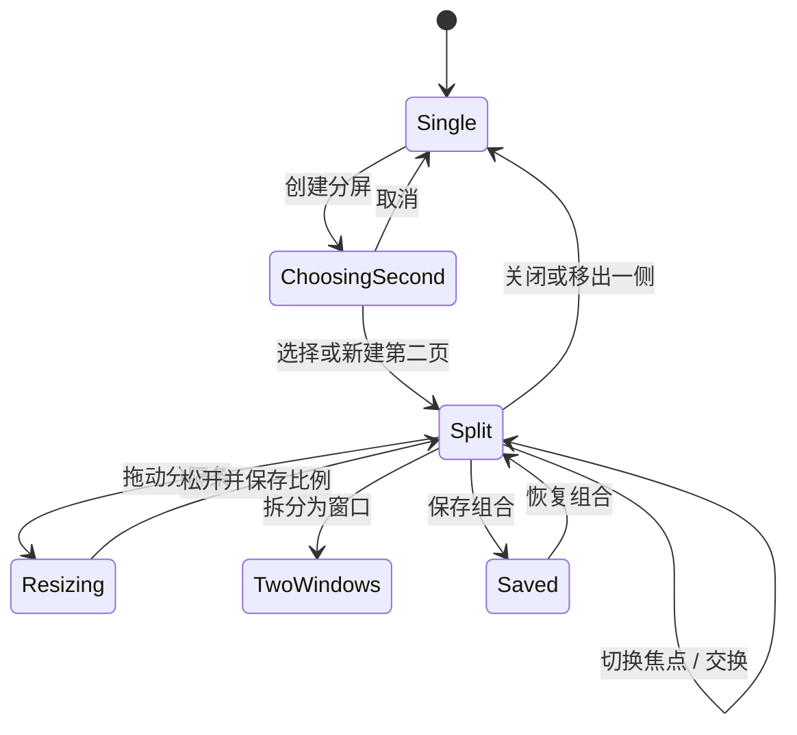

# 交互与界面设计

## 主窗口

```text
普通窗口（性能监测开启）
┌──────────────┬───────────────────────────────────────────────┐
│ ●  ●  ●      │                                               │
│ [内存] [CPU] │ ◀ ▶ ↻  [ 当前焦点页地址 / 搜索       ]  ◇  ⋯ │
├──────────────┴───────────────┬───────────────────────────────┤
│ 工作空间 / 垂直标签          │ 主页面 / 按需出现的次页面      │
└──────────────────────────────┴───────────────────────────────┘

全屏
┌──────────────────────────────────────────────────────────────┐
│ [内存] [CPU]  ◀ ▶ ↻  [ 当前焦点页地址 / 搜索       ]  ◇  ⋯ │
├──────────────────────────────┬───────────────────────────────┤
│ 工作空间 / 垂直标签          │ 主页面 / 按需出现的次页面      │
└──────────────────────────────┴───────────────────────────────┘
```

侧栏默认宽 264 pt，可在 220–360 pt 调整。折叠后保留 58 pt 图标轨道；自动隐藏时网页扩展到窗口边缘。窗口使用全尺寸内容标题栏。普通窗口启用性能监测时，标题栏槽高 78 pt，内部使用两张 72 pt 卡片和 6 pt 间距：左卡上部覆盖原生红黄绿按钮区域，内存与 CPU 指标横排在按钮下方；右卡承载其余导航控件。关闭性能监测时，普通窗口回落为 50 pt 标题栏槽与 44 pt 卡片，左侧只保留交通灯卡。全屏始终使用 50 pt 标题栏槽与单张 44 pt 导航卡；开启监测时指标内联在导航控件左侧，关闭时连同分隔线一起移除。地址栏始终反映当前获得焦点的分屏页面。

## 性能监测

内存和 CPU 指标都是详情入口，点击任一指标打开 760 × 520 pt 性能页。顶部显示 Rex 总内存、总 CPU、标签页数量与最近更新时间；网页列表展示 favicon、标题、域名、生命周期、内存和 CPU，并可用分段控件按 CPU 或内存降序排列。首次 CEF 任务刷新约需 2 秒，完成前显示进度状态；无标签页时显示空状态，暂时没有任务指标的标签以「—」占位。最后一个性能界面订阅结束时释放 CEF 任务管理器，停止后台指标刷新。

网页行表示 Chromium 为该标签返回的主任务指标。CEF 公共 TaskManager API 不公开 renderer PID，无法可靠判断哪些 WebContents 共享同一 renderer；共享时多行可能出现相同的进程级数值，因此不应将各行相加后与 Rex 总量比较。GPU、专用/共享 worker 等未归属网页的进程只进入 Rex 总量，不在列表中分摊。

## 视觉方向

- 品牌强调色使用低饱和紫蓝与冰蓝渐变；状态不只依赖颜色。
- 玻璃层由系统材质、1 px 高光描边、轻阴影构成；网页画布保持不透明。
- 当前标签以更高不透明度、左侧短高光和清晰标题表示。
- 分屏焦点通过侧栏选中标签和地址栏内容表示，不在网页画布上叠加蓝色选择框。
- 动画为 150–260 ms；减少动态效果时改为无位移淡入淡出。

## 垂直标签

单击切换；双击固定；关闭按钮仅在悬停/键盘焦点时出现。标签页右键菜单提供固定、分组、工作空间和分屏操作；分屏子菜单按当前状态提供创建、左右放置、替换、换侧或退出。多选后提供移动、分组、休眠、归档和关闭。固定区不参与自动归档，播放媒体、会议、下载上传和分屏标签不自动休眠。

## 工作空间

侧栏顶部以图标胶囊呈现空间。单击切换，Control+1…9 直达；触控板横滑只在指针位于侧栏时生效，避免与网页导航冲突。空间主题色只影响原生导航层。第一阶段共享浏览器资料库；独立 Cookie 容器为实验选项。

## 分屏交互

创建入口：工具栏按钮、标签页右键菜单、链接菜单和 Command+Shift+S。没有候选页时创建空白次页。右键其他标签可选择放到左侧或右侧；已有分屏时可替换指定页面，分屏成员可换侧或退出并保留该标签。标签拖放不用于分屏。

分隔条默认 8 pt 命中区/1 pt 可见线；悬停显示把手、交换和拆分按钮。比例限制为 25%–75%。拖动只更新原生容器 frame，不重建网页实例。



恢复顺序：读取窗口与空间 → 创建标签元数据 → 创建主页面 → 创建次页面 → 应用左右布局与比例 → 各自恢复导航和缩放 → 最后恢复焦点与滚动位置。旧上下分屏数据在恢复时转换为左右布局。任一 URL 失败时保留错误页和重试动作，不丢弃组合。

## 隐私盾牌

按钮同时显示保护状态和该标签累计的拦截数量。面板第一屏回答“保护是否开启、拦截了什么、站点拥有什么权限”；保护开关和级别写入当前标签页策略，统计不会在每次导航时自动清零。第三方 Cookie 限制来自 profile 级全局设置，因此不随单个标签页盾牌开关切换。

标准模式对第三方广告/追踪目录做匹配，并在默认指纹保护开启时阻止第三方已知指纹服务；严格模式追加社交目录；自定义模式扩大广告/追踪目录的第一方匹配，并对第三方请求启用有限路径启发式。面板不把这些能力表述为通用反指纹、恶意网站检测或 Safe Browsing。

## 资料库

历史记录标题栏提供「删除浏览数据」菜单，选项为过去 1 小时、过去 24 小时、过去 7 天和所有时间。确认框需同时显示所选范围、永久删除性质，以及收藏和下载不会被删除。删除成功后当前搜索结果立即刷新。收藏和下载空状态填满标题栏下方的剩余内容区，避免标题栏被内容垂直居中推到窗口中部。

## 键盘与无障碍

实现系统标准快捷键及需求中的分屏快捷键。每个图标有 VoiceOver 标签和工具提示；焦点顺序为工具栏→空间→标签→网页→浮层。降低透明度时改用近实体面板；增强对比度时加粗描边；所有状态同时使用图标或文字。
