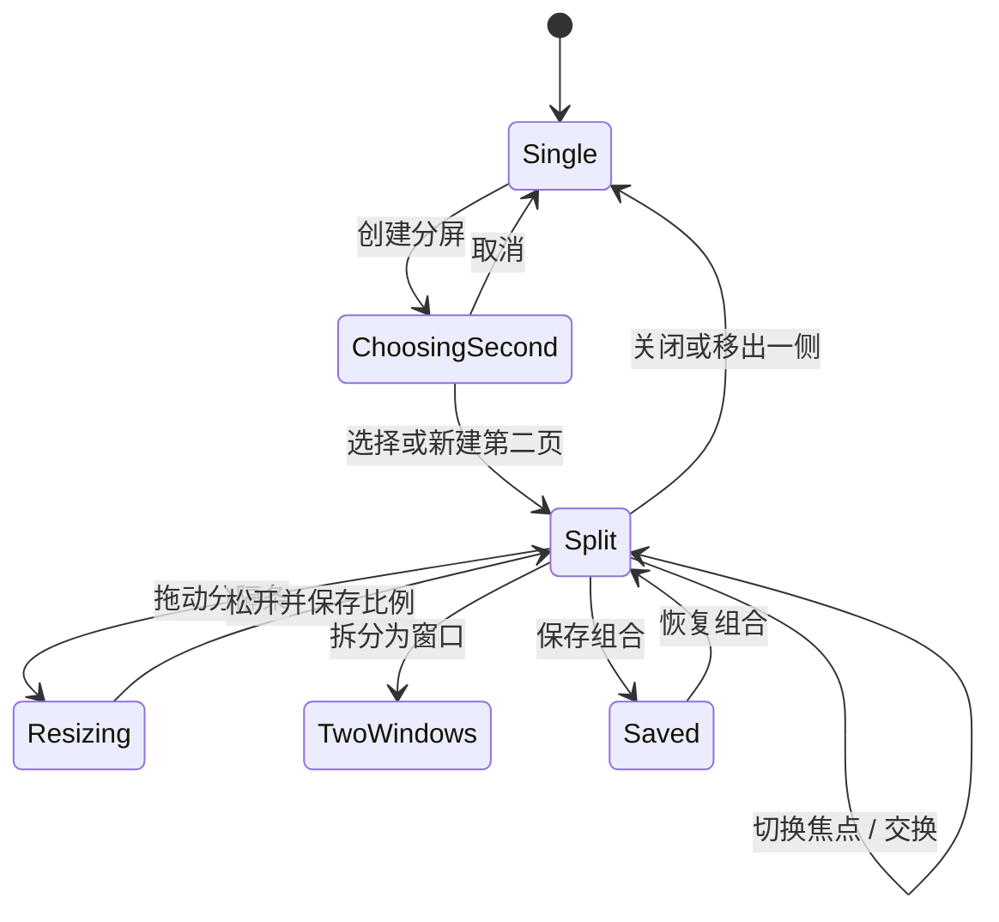

# 交互与界面设计

## 主窗口

```text
普通窗口（性能监测开启）
┌──────────────────────────────────────────────────────────────┐
│ ●  ●  ●   [内存] [CPU]  ◀ ▶ ↻  [ 当前焦点页地址 / 搜索 ]  ◇  ⋯ │
├──────────────────────────────┬───────────────────────────────┤
│ 工作空间 / 垂直标签          │ 主页面 / 按需出现的次页面      │
└──────────────────────────────┴───────────────────────────────┘

全屏
┌──────────────────────────────────────────────────────────────┐
│ [内存] [CPU]  ◀ ▶ ↻  [ 当前焦点页地址 / 搜索       ]  ◇  ⋯ │
├──────────────────────────────┬───────────────────────────────┤
│ 工作空间 / 垂直标签          │ 主页面 / 按需出现的次页面      │
└──────────────────────────────┴───────────────────────────────┘
```

侧栏默认宽 264 pt，可在 220–360 pt 调整。折叠后保留 58 pt 图标轨道；自动隐藏时网页扩展到窗口边缘。窗口使用全尺寸内容标题栏，标题栏槽固定为 50 pt，内部使用单张 44 pt 导航卡。普通窗口将原生红黄绿按钮整体下移 8 pt，使其与导航卡垂直居中，再根据按钮实际尾缘动态留出左侧拖动区；全屏时恢复系统按钮位置并改用 8 pt 普通边距。性能指标开启时是导航栏首项，关闭时直接移除；不在标题栏空白区重复放置页面标题或装饰控件。地址栏始终反映当前获得焦点的分屏页面。

## 性能监测

内存和 CPU 指标都是详情入口，点击任一指标打开 760 × 520 pt 性能页。顶部显示 Rex 总内存、总 CPU、标签页数量与最近更新时间；汇总卡下方直接使用放大的网页/内存/CPU 列标题，不重复显示「网页」区标题。网页列表按标签页顺序稳定展示 favicon、标题、域名、生命周期、内存和 CPU，每个网页使用独立卡片，不使用动态排序按钮或行分隔线。首次 CEF 任务刷新约需 2 秒，完成前显示进度状态；无标签页时显示空状态，暂时没有任务指标的标签以「—」占位。最后一个性能界面订阅结束时释放 CEF 任务管理器，停止后台指标刷新。

网页行表示 Chromium 为该标签返回的主任务指标。CEF 公共 TaskManager API 不公开 renderer PID，无法可靠判断哪些 WebContents 共享同一 renderer；共享时多行可能出现相同的进程级数值，因此不应将各行相加后与 Rex 总量比较。GPU、专用/共享 worker 等未归属网页的进程只进入 Rex 总量，不在列表中分摊。

## 新标签页

问候区左侧使用当前默认搜索引擎的本地品牌图标，与搜索框内图标保持一致。最近访问与收藏网站在双列布局中共享相同的列宽和 380 pt 稳定高度；站点项不再嵌套纵向滚动，统一由新标签页外层滚动。宽度不足时两个区域依次换行，仍保持等宽等高规则。

收藏网站标题栏只保留明确的「新增」命令。点击后弹出原生表单，顺序输入名称和网址；未填写 scheme 时默认 HTTPS，只接受 HTTP/HTTPS，拒绝凭据 URL 和重复项。Return 可从名称移到网址并提交，Escape 取消。新标签页收藏与资料库书签继续相互独立。

## 视觉方向

- 品牌强调色使用低饱和紫蓝与冰蓝渐变；状态不只依赖颜色。
- 玻璃层由系统材质、1 px 高光描边、轻阴影构成；网页画布保持不透明。
- 当前标签以更高不透明度、左侧短高光和清晰标题表示。
- 分屏焦点通过侧栏选中标签和地址栏内容表示，不在网页画布上叠加蓝色选择框。
- 动画为 150–260 ms；减少动态效果时改为无位移淡入淡出。

## 垂直标签

单击切换；双击固定；关闭按钮仅在悬停/键盘焦点时出现。标签页右键菜单提供固定、分组、工作空间和分屏操作；分屏子菜单按当前状态提供创建、左右放置、替换、换侧或退出。多选后提供移动、分组、休眠、归档和关闭。固定区不参与自动归档，播放媒体、会议、下载上传和分屏标签不自动休眠。

## 工作空间

侧栏顶部以图标胶囊呈现空间。单击切换，Control+1…9 直达；触控板横滑只在指针位于侧栏时生效，避免与网页导航冲突。空间主题色只影响原生导航层。第一阶段共享浏览器资料库；独立 Cookie 容器为实验选项。

## 分屏交互

创建入口：工具栏按钮、标签页右键菜单、链接菜单和 Command+Shift+S。没有候选页时创建空白次页。右键其他标签可选择放到左侧或右侧；已有分屏时可替换指定页面，分屏成员可换侧或退出并保留该标签。标签拖放不用于分屏。

分隔条默认 8 pt 命中区/1 pt 可见线；悬停显示把手、交换和拆分按钮。比例限制为 25%–75%。拖动只更新原生容器 frame，不重建网页实例。



恢复顺序：读取窗口与空间 → 创建标签元数据 → 创建主页面 → 创建次页面 → 应用左右布局与比例 → 等待 extension-ready generation → 各自恢复导航和缩放 → 最后恢复焦点与滚动位置。HTTP(S) 页面在等待期间保持 `about:blank`，扩展集合完成精确对账后才发出目标 URL 的首次请求；预期集合为空时也先清理 profile 中的陈旧受管注册。旧上下分屏数据在恢复时转换为左右布局。任一 URL 失败时保留错误页和重试动作，不丢弃组合。

## 隐私盾牌

按钮同时显示保护状态和该标签累计的拦截数量。面板第一屏回答“保护是否开启、拦截了什么、站点拥有什么权限”；保护开关和级别按 profile 与主机名持久化，像 Safari 网站设置一样立即同步到所有已打开的同站标签，之后进入该网站时继续复用。统计仍按标签累计，不会在每次导航时自动清零。第三方 Cookie 限制来自 profile 级全局设置，因此不随单个网站盾牌开关切换。

标准模式对第三方广告/追踪目录做匹配，并在默认指纹保护开启时阻止第三方已知指纹服务；严格模式追加社交目录；自定义模式扩大广告/追踪目录的第一方匹配，并对第三方请求启用有限路径启发式。面板不把这些能力表述为通用反指纹、恶意网站检测或 Safe Browsing。

## 资料库

历史记录标题栏提供「删除浏览数据」菜单，选项为过去 1 小时、过去 24 小时、过去 7 天和所有时间。确认框需同时显示所选范围、永久删除性质，以及收藏和下载不会被删除。删除成功后当前搜索结果立即刷新。收藏和下载空状态填满标题栏下方的剩余内容区，避免标题栏被内容垂直居中推到窗口中部。

## 关于、菜单与扩展

关于 Rex 的版本、构建、Chromium、CEF、架构、通道、功能分组和已知限制统一来自 `AppVersion`、`features.json` 与 `releases.json`，不在设置页另维护一套版本文字。「版本与功能」进入完整发布记录。文件、编辑、显示、窗口、帮助及常用系统命令使用中文标题，但不更改 target/action、状态和快捷键；输入法、第三方服务和动态窗口标题仍由 macOS 管理。

Rex 扩展页分为「发现」与「已导入」。发现页展示有真实 Chrome Web Store ID 的精选扩展，支持搜索、分类和一键直接安装；用户也可粘贴任意官方详情链接或 32 位扩展 ID。安装过程展示下载、验证、解包、导入、运行时同步、成功、失败与重试状态；进行中的下载进度约每 80 ms 合并发布一次，终态立即显示。已导入页同时管理商店验签包与用户选择的 Manifest V2/V3 文件夹副本，区分安装来源与当前启用状态，并提供启停、定位、手动更新和移除操作。安装、启用、停用、更新与移除在当前进程完成 Chromium 对账后生效，不显示重启要求；同步失败时必须显示明确错误，不能把仅写入磁盘误呈现为运行时成功。

正常浏览与扩展功能不显示 Chrome 自己的标签栏、地址栏或扩展管理页。点击工具栏扩展按钮先打开 Rex 的已安装列表，点击任意扩展整行进入小型面板；小型面板直接加载清单声明的静态 `default_popup`，管理操作进入 Rex 的扩展管理界面，清单声明的 options 进入 `rex-extension://<runtime-id>/<包内路径>` 资源页。Rex 只提供这些容器、状态与导航；静态 `default_popup` 与 options 内容直接来自已安装扩展包，内部在 `chrome-extension://` 安全源中执行，对外显示为 `rex-extension://`，不为 AdGuard 或其他单个扩展重做业务界面。稳定尺寸和滚动边界不得因站点名、权限数量或空状态变化而导致工具栏和网页区域跳动。

popup 面板跟随扩展内容的原生尺寸，并限制在宿主允许范围内；实测非广告 fixture 为 `280×113`，AdGuard 为 `320×600`，两者都使用同一通用容器。普通 Rex 起始页、侧栏、导航栏与分屏不因扩展交互改变布局，不允许裁剪网页、使用负偏移或以 Chrome 顶层窗口覆盖 Rex。未托管 Chrome extension popup/auxiliary window 的普通网页目标转交 Rex 后关闭辅助窗口；转交 `chrome.tabs.create` 目标时不得由临时 Chrome browser 和 Rex 标签重复加载同一主文档。

每次热安装、启用、停用、更新或移除成功后，当前已加载的 HTTP(S) 页面自动重载一次，让内容脚本与 DNR 立即应用或撤销；`about:`、`rex-extension:` 等内部页不重载。扩展界面必须持续说明实际兼容边界：运行时同步使用不开放监听端口的 `--remote-debugging-pipe`，但 Rex 小型面板仍不是 Chromium 原生 action popup；v0.9.5 只为静态 popup 补充来源网页的 active/currentWindow 查询上下文，完整 `activeTab` 权限、无 popup 的 `action.onClicked` 与动态 `action.setPopup` 仍不支持。发布探针必须检查未刷新、未重复导航的首次文档，界面不得把该探针结果表述为所有 Chrome Web Store 扩展或全部 Chrome API 均已兼容。

## 键盘与无障碍

实现系统标准快捷键及需求中的分屏快捷键。每个图标有 VoiceOver 标签和工具提示；焦点顺序为工具栏→空间→标签→网页→浮层。降低透明度时改用近实体面板；增强对比度时加粗描边；所有状态同时使用图标或文字。
