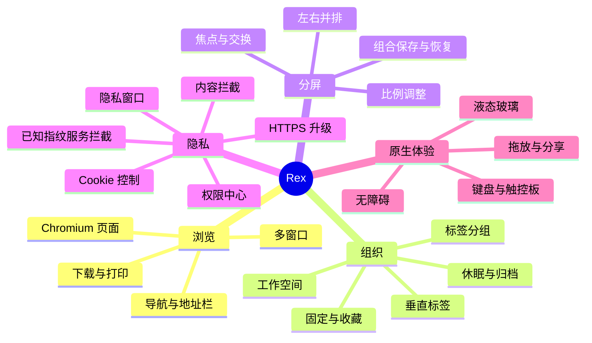

# Rex 产品需求基线

版本：v0.8.1  
日期：2026-07-27

## 1. 产品定义

Rex 是一款内容优先、隐私默认开启的 macOS 桌面浏览器。产品以原生 SwiftUI/AppKit 外壳承载 Chromium，多标签管理不再依赖顶部横条，而以工作空间中的垂直标签为主要导航；双页面分屏是一级浏览模式。

Rex 借鉴同类产品解决问题的方法，但使用独立的品牌、信息架构、视觉组件和实现。产品明确排除 AI 聊天、网页总结、AI 搜索、自动整理与自动操作。

## 2. 目标用户与关键场景

| 用户 | 主要任务 | Rex 价值 |
|---|---|---|
| 知识工作者 | 对照资料与编辑文档 | 保存并恢复双页组合，减少来回切换 |
| 开发者 | 文档、控制台、预览并行 | 工作空间隔离，双页独立导航与 DevTools |
| 学生与研究者 | 收集、分组、阶段性归档 | 长标题垂直标签、分组、休眠和归档 |
| 隐私敏感用户 | 理解并控制站点行为 | 可解释的站点保护报告与权限中心 |

## 3. 产品原则

1. 网页内容始终是视觉中心；侧栏可折叠，工具栏只保留高频动作。
2. 垂直标签、工作空间与分组构成统一的信息模型。
3. 分屏是一个包含两张标签页引用的可恢复会话，而不是网页截图或临时布局。
4. 隐私保护默认启用；内容拦截按标签页开关与级别执行，阻断结果按类别和域名回传。
5. 原生层不向网页暴露高权限系统 API；所有桥接命令必须在白名单内验证。
6. 液态玻璃只用于导航与浮层，不覆盖网页内容。

## 4. 功能地图

## 5. 信息架构

- 窗口
  - 当前工作空间
    - 收藏（跨空间共享可选）
    - 固定标签与分组
    - 临时标签
    - 已保存分屏组合
  - 当前浏览会话
    - 单页，或双页分屏
    - 当前焦点页
  - 全局浮层
    - 地址/命令输入
    - 隐私盾牌
    - 下载、权限、页面查找
- 设置
  - 常规、外观、标签与空间
  - 隐私与权限
  - 下载与资料
  - 快捷键
  - 关于与版本功能

## 6. 首发成功指标

- 冷启动后可恢复上次窗口、空间、标签顺序和分屏比例。
- 20 个标签下，目标标签可在不横向滚动的情况下通过列表或搜索到达。
- 创建分屏不超过两次显式操作；键盘可完成创建、聚焦、交换和关闭。
- 隐私盾牌在一次点击内说明当前站点拦截项和权限。
- 核心 UI 在正常交互与分隔条拖动时保持 60 FPS；网页视图不因 SwiftUI 状态刷新而重建。

## 7. 当前 Beta 范围（v0.8.1）

当前范围包含 Chromium 页面加载、基础导航、垂直标签、工作空间、仅左右分屏、会话恢复、下载、收藏/历史、四档时间范围历史删除、精选域名目录内容拦截、profile 级第三方 Cookie 限制、顶层导航追踪参数清理与 HTTPS 尝试、站点权限、隐私窗口、键盘操作与无障碍。导航栏与 macOS 红黄绿窗口按钮同行；收藏和下载空状态从资料库标题栏下方开始布局。

当前内容拦截只覆盖内置的已知广告、追踪、指纹和社交服务目录，以及自定义模式下的有限路径启发式。恶意网站检测、Safe Browsing、自定义规则订阅、EasyList、通用指纹随机化、完整 PSL/eTLD+1 分类、扩展商店兼容和独立 Cookie 容器均不属于已实现范围。

## 8. 非目标

- 不做跨平台 Windows/Linux 版本。
- 不承诺完整 Chrome Web Store 兼容。
- 不在首发支持账户云同步。
- 不绕开 Chromium 同源策略、沙箱、权限或文件访问限制。
