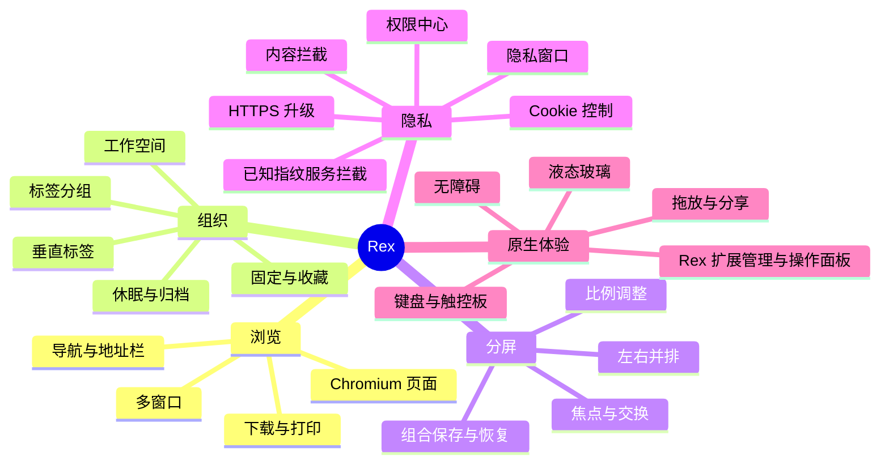

# Rex 产品需求基线

版本：v0.9.4
日期：2026-07-28

## 1. 产品定义

Rex 是一款内容优先、隐私默认开启的 macOS 桌面浏览器。产品以原生 SwiftUI/AppKit 外壳承载 Chromium，多标签管理不再依赖顶部横条，而以工作空间中的垂直标签为主要导航；双页面分屏是一级浏览模式。

Rex 借鉴同类产品解决问题的方法，但使用独立的品牌、信息架构、视觉组件和实现。产品明确排除 AI 聊天、网页总结、AI 搜索、自动整理与自动操作。

## 2. 目标用户与关键场景

| 用户 | 主要任务 | Rex 价值 |
|---|---|---|
| 知识工作者 | 对照资料与编辑文档 | 保存并恢复双页组合，减少来回切换 |
| 开发者 | 文档、控制台、预览并行 | 工作空间隔离，双页独立导航与 DevTools |
| 学生与研究者 | 收集、分组、阶段性归档 | 长标题垂直标签、分组、休眠和归档 |
| 隐私敏感用户 | 理解并控制站点行为 | 可解释的站点保护报告与权限中心 |

## 3. 产品原则

1. 网页内容始终是视觉中心；侧栏可折叠，工具栏只保留高频动作。
2. 垂直标签、工作空间与分组构成统一的信息模型。
3. 分屏是一个包含两张标签页引用的可恢复会话，而不是网页截图或临时布局。
4. 隐私保护默认启用；内容拦截按标签页开关与级别执行，阻断结果按类别和域名回传。
5. 原生层不向网页暴露高权限系统 API；所有桥接命令必须在白名单内验证。
6. 液态玻璃只用于导航与浮层，不覆盖网页内容。
7. Rex 自行实现浏览器窗口、扩展列表、小型面板容器和管理页，不复用 Chrome 浏览器界面；小型面板直接加载扩展声明的静态 `default_popup`，options 与已支持的后台、内容脚本等能力仍由真实扩展包和 Chromium 提供。

## 4. 功能地图

## 5. 信息架构

- 窗口
  - 当前工作空间
    - 收藏（跨空间共享可选）
    - 固定标签与分组
    - 临时标签
    - 已保存分屏组合
  - 当前浏览会话
    - 单页，或双页分屏
    - 当前焦点页
  - 全局浮层
    - 地址/命令输入
    - 隐私盾牌
    - 扩展操作、下载、权限、页面查找
- 设置
  - 常规、外观、标签与空间
  - 隐私与权限
  - 下载与资料
  - 快捷键
  - 关于与版本功能
  - Rex 扩展
    - 发现与受管安装
    - 已导入包与 Chromium 运行状态
    - 小型面板、扩展管理界面与 rex-extension 真实资源页

## 6. 首发成功指标

- 冷启动后可恢复上次窗口、空间、标签顺序和分屏比例。
- 冷启动恢复的 HTTP(S) 页面在扩展运行时精确对账后才发出首次请求；扩展热变更无需重启，活跃普通页面立即重载一次，休眠页面恢复时重载一次，隐私窗口不运行扩展。
- 20 个标签下，目标标签可在不横向滚动的情况下通过列表或搜索到达。
- 创建分屏不超过两次显式操作；键盘可完成创建、聚焦、交换和关闭。
- 隐私盾牌在一次点击内说明当前站点拦截项和权限。
- 核心 UI 在正常交互与分隔条拖动时保持 60 FPS；网页视图不因 SwiftUI 状态刷新而重建。

## 7. 当前 Beta 范围（v0.9.4）

当前范围包含 Chromium 页面加载、基础导航、垂直标签、工作空间、仅左右分屏、会话恢复、下载、收藏/历史、四档时间范围历史删除、精选域名目录内容拦截、profile 级第三方 Cookie 限制、顶层导航追踪参数清理与 HTTPS 尝试、站点权限、隐私窗口、键盘操作与无障碍。新标签页使用等宽等高的最近访问/收藏网站区域，问候区显示当前搜索引擎图标，收藏网站通过名称和网址表单新增。关于 Rex 展示当前版本、构建、内核、架构、功能与已知限制；应用主菜单使用中文标题。

当前内容拦截覆盖内置的已知广告、追踪、指纹和社交服务目录，以及自定义模式下的有限路径启发式。扩展声明的 DNR 由 Chromium 扩展运行时执行，不并入 Rex 内置隐私目录。

Rex 扩展商店提供 Chrome Web Store 精选目录、一键安装，以及任意官方详情链接/扩展 ID 的 CRX 下载、身份/签名校验、安全解包和受管安装；本地未打包扩展也可继续导入。Rex 提供扩展列表、小型面板容器与管理界面；小型面板直接加载清单声明的静态 `default_popup`，options 等真实扩展资源内部在 `chrome-extension://` 安全源中执行，对外映射为 `rex-extension://<runtime-id>/<包内路径>`。已验证的后台服务、内容脚本、runtime messaging、`chrome.storage.local` 与 DNR 从安装包加载并由 Chromium 执行，不设置 AdGuard 或其他单扩展专用执行路径。

商店包读取时核对 manifest 公钥推导的 runtime ID；安装、启用、停用、手动更新和移除通过无监听端口的 `--remote-debugging-pipe` 与 Chromium 即时对账。冷启动恢复的 HTTP(S) 页面等待 extension-ready generation 后才发出首次导航，预期集合为空时也先清理 profile 中的陈旧受管注册。热变更成功后，活跃普通页面立即重载一次，休眠页面恢复时重载一次，隐私窗口不参与。`chrome.tabs.create` 的目标转交只允许一个主文档请求，不能让临时 Chrome browser 与 Rex 正式标签重复导航。

同路径更新在换盘前写入持久 replacement journal，只有 Chromium ack 后才清理上一版本；确认前崩溃会在下次启动恢复旧包。扩展目录启动校验每包只完整扫描一次，启停不重新遍历包文件；manifest 的名称与描述共享一次 locale 消息文件读取。多个普通窗口只触发一次进程级首次全量对账，窗口关闭会取消事件订阅。Chrome Web Store 下载中的进度约每 80 ms 合并发布一次，完成、取消和失败状态立即送达。通用 MV3 发布探针必须忽略隐藏 `about:blank` 扩展上下文，在不刷新、不重复导航的首次文档上覆盖 service worker、content script、runtime messaging、`chrome.storage.local`、Chromium DNR、options、静态 `default_popup` 和热生命周期。

Rex 小型面板不触发 Chromium 原生 action popup；stock CEF 150 Alloy 当前不提供 `activeTab`、`chrome.tabs` 当前窗口语义、未声明静态 `default_popup` 时的 `action.onClicked` 或动态 `action.setPopup`。这些能力边界不构成完整 Chrome Web Store 兼容承诺。

恶意网站检测、Safe Browsing、自定义规则订阅、EasyList、通用指纹随机化、完整 PSL/eTLD+1 分类和独立 Cookie 容器不属于已实现范围。

## 8. 非目标

- 不做跨平台 Windows/Linux 版本。
- 不承诺完整 Chrome Web Store 兼容。
- 不通过嵌入 Chrome 浏览器界面替代 Rex 的产品外壳；扩展自带页面只在 Rex 容器中作为扩展功能内容运行。
- 不提供系统密码调用；Rex 源码和主可执行文件不依赖 `SystemPasswordsCoordinator` 或 `AuthenticationServices`，打包门槛拒绝该主 executable 依赖或任何 `.systemextension`。上游 Chromium Embedded Framework 自身的系统 framework 链接不属于 Rex 密码功能。
- 不在首发支持账户云同步。
- 不绕开 Chromium 同源策略、沙箱、权限或文件访问限制。
